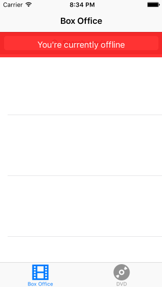

## Rotten Tomatoes

This is a movies app displaying box office and top rental DVDs using the [Rotten Tomatoes API](http://developer.rottentomatoes.com/docs/read/JSON).

Time spent: 10 hours

### Features

#### Required

- [x] User can view a list of movies. Poster images load asynchronously.
- [x] User can view movie details by tapping on a cell.
- [x] User sees loading state while waiting for the API.
- [x] User sees error message when there is a network error: 
- [x] User can pull to refresh the movie list.

#### Optional

- [x] All images fade in.
- [x] Add a tab bar for Box Office and DVD.
- [x] Add a search bar: pretty simple implementation of searching against the existing table view data.
- [ ] For the larger poster, load the low-res first and switch to high-res when complete.
- [ ] All images should be cached in memory and disk: AppDelegate has an instance of `NSURLCache` and `NSURLRequest` makes a request with `NSURLRequestReturnCacheDataElseLoad` cache policy. I tested it by turning off wifi and restarting the app.
- [ ] Customize the highlight and selection effect of the cell.
- [ ] Customize the navigation bar.

#### Additional

- [x] Restricting the app to Portrait orientation

### Walkthrough

Note: This was built specifically for 4" iPhone screens and may not function properly for other iPhone screen sizes.

Credits
---------
* [Rotten Tomatoes API](http://developer.rottentomatoes.com/docs/read/JSON)
* [AFNetworking](https://github.com/AFNetworking/AFNetworking)
* GIF created with [LiceCap](http://www.cockos.com/licecap/)
